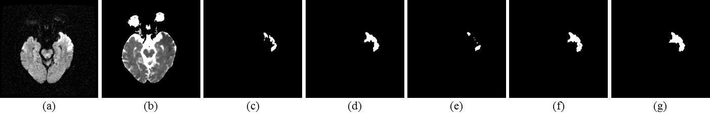
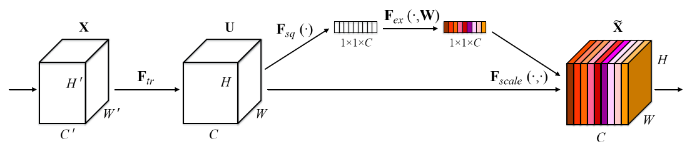
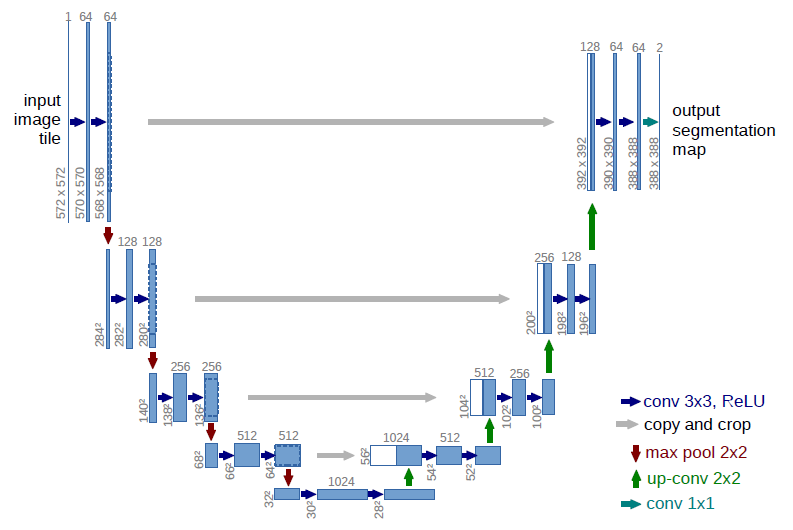
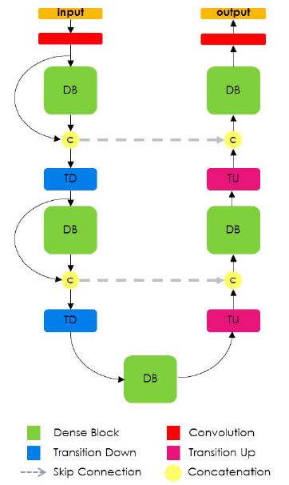
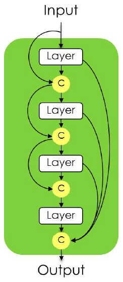
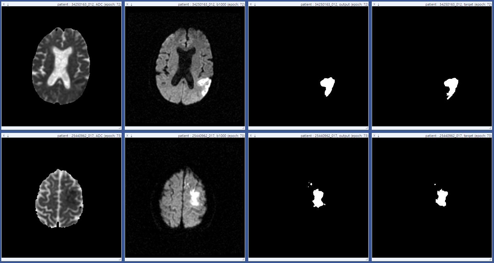
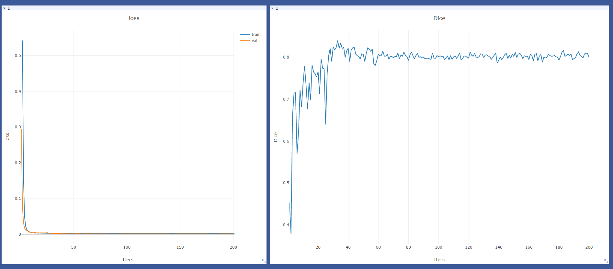

# Semantic Segmentation Using SE block in PyTorch

This is our ongoing PyTorch implementation for [Semantic Segmentation with Squeeze-and-Excitation Block: Application to
Infarct Segmentation in DWI, Medical Imaging Meets NIPS workshop, NIPS 2017](https://www.doc.ic.ac.uk/~bglocker/public/mednips2017/med-nips_2017_paper_25.pdf)



Results of our proposed method and baseline networks. (a) b1000 image (b)ADC map (c) DenseNet (d) SE-DenseNet (e) UNet (f) SE-UNet (g) Ground truth.

We replace fully connected layer with 1x1 convolution layer in original excitation operation and observed that 16 reduction ratio of excitation is better. 



You can refer to [Squeeze-and-Excitation Networks](https://arxiv.org/abs/1709.01507)


# Prerequisites

- [Python](https://www.anaconda.com/download/) 2.7
- [PyTorch](http://pytorch.org/) >= 0.2.0
- [Visdom](https://github.com/facebookresearch/visdom)
- [NumPy](http://www.numpy.org/)

# Dataset

You have to construct suitable dataloader for your dataset. For example, we generate our dataloader for below data structure.

    |---ADC
    
        |---train
        
        |---val
        
        |---test
        
    |---b1000
    
        |---train
        
        |---val
        
        |---test
        
    |---mask
    
        |---train
        
        |---val
        
        |---test

We only open a part of our test data because of patient information.

# SE-Unet

[U-Net: Convolutional Networks for Biomedical Image Segmentation](https://arxiv.org/abs/1505.04597) can be divided into three blocks, e.g. encoding, bottleneck, and decoding blocks



Instead, SE-Unet is built on SE-encoding, SE-bottleneck, and SE-decoding blocks that stack SE block behind each block, respectively.
If you want to use SE-Unet, you have to set reduction ratio.

- SE-Unet

```bash
python train.py --root_dir ./data --save_dir ./weight --model se_unet --reduction_ratio 16 --network_depth 4 --bottleneck 5 --init_features 32 --gpu_ids 0,1 --batch_size 20
```

- Unet

```bash
python train.py --root_dir ./data --save_dir ./weight --model unet --network_depth 4 --bottleneck 5 --init_features 32 --batch_size 20 --gpu_ids 0,1
```


# SE-Densenet

Denseblock is key component of Densenet and is constructed by growth rate. Details of denseblock is illustrated by [The One Hundred Layers Tiramisu: Fully Convolutional DenseNets for Semantic Segmentation](https://arxiv.org/abs/1611.09326)

 

SE-Densenet is constructed by stacking a SE-denseblocks and they are generated by adding SE block to original denseblock.
If you want to use SE-Densenet, you have to set reduction ratio.

- SE-Densenet

```bash
python train.py --root_dir ./data --save_dir ./weight --model se_densenet --down_blocks 4,5,7,10,12 --up_blocks 12,10,7,5,4 --growth_rate 16 --reduction_ratio 16 --batch_size 2 --bottleneck 15 --init_features 48 --gpu_ids 0,1```

- Densenet

```bash
python train.py --root_dir ./data --save_dir ./weight --model densenet --down_blocks 4,5,7,10,12 --up_blocks 12,10,7,5,4 --growth_rate 16 --batch_size 2 --bottleneck 15 --init_features 48 --gpu_ids 0,1```
```

# Test

We upload [pretrained weight](https://drive.google.com/open?id=1VbQXOXL9tPIWr-YdGZeCAqHTsrAhY0PS) of SE-Unet. You have to generate below model architecture and use two gpus in order to load a pretrained weight.

```bash
python test.py --root_dir ./data --weight_dir ./weight/se_unet/se_unet.pth --save_dir ./results --model se_unet --reduction_ratio 16 --network_depth 4 --bottleneck 5 --init_features 32 --gpu_ids 0,1
```


# Training/test Details

# Visualizatoin

- To view training results and loss plots, you should run visdom before training
```bash
python -m visdom.server
```
click the URL http://localhost:8097





# References

Some codes are from

- https://github.com/bodokaiser/piwise
- https://github.com/ycszen/pytorch-seg
- https://github.com/meetshah1995/pytorch-semseg
- https://github.com/moskomule/senet.pytorch
    
# Acknowledgments

This work was supported by Kakao Corp. and Kakao Brain Corp.